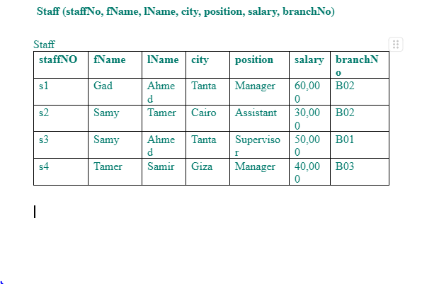

**1.** Create DB named ```met``` with table named ```staff```, and insert the following data


---

**2.** Write an SQL query to retrieve all columns and all rows from the `Staff` table **without using `*`**.

---

**3.** Write an SQL query to display only the following columns:
`staffNo`, `fName`, `position`, and `salary`.

---

**4.** Write an SQL query to list all unique cities where staff members live.

---

**5.** Write an SQL query to display:

* `staffNo`
* `fName`
* `lName`
* yearly salary increased by 10%

Name the calculated column `increasedSalary`.

---

**6.** The `SELECT` statement automatically removes duplicate rows unless `ALL` is specified.
(   ) True
(   ) False

---

**7.** Which clause is used to remove duplicate rows?
A) WHERE
B) GROUP BY
C) DISTINCT
D) ORDER BY

---

**8.** What will be the output column name in this query (if no alias is used)?

```sql
SELECT salary/12
FROM Staff;
```
A) salary
B) monthlySalary
C) col4 (or system-generated name)
D) 12

---
**9.** Can you write a query includes ```distinct city``` beside other columns? and state why not. 