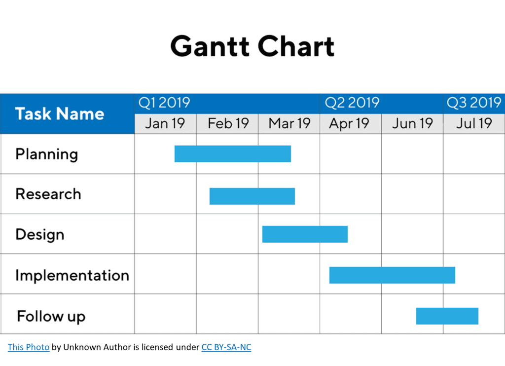
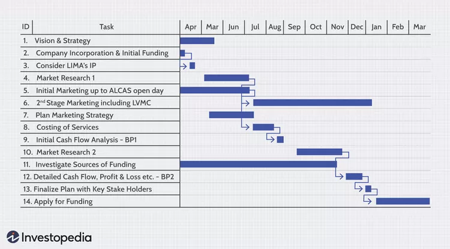

# Gantt Chart


## 1. What is a Gantt Chart?
A **Gantt Chart** is a horizontal bar chart used in project management to visually represent a project schedule:
* **Vertical Axis (Y):** Lists all the tasks and activities required for the project.
* **Horizontal Axis (X):** Displays the project timeline (days, weeks, or months).
* **Horizontal Bars:** Each task is represented by a bar where the position marks the start and end dates, and the length represents the duration.

---

## 2. Importance & Benefits
* **Complete Overview:** Provides an instant, high-level visual summary of the entire project without needing to read lengthy documents.
* **Clear Task Sequencing:** Distinguishes tasks that can run in parallel from tasks that must run sequentially.
* **Priority Management:** Pinpoints critical tasks whose delays will postpone the entire project completion date.
* **Resource Allocation:** Prevents team overload and scheduling conflicts by clearly showing who does what and when.

---

## 3. Real-World Example: Organizing a Tech Conference

### Task Breakdown

| Task | Duration (Days) | Dependency |
| :--- | :---: | :--- |
| **1. Venue Booking & Contract Signing** | 3 | None (Starts on Day 1) |
| **2. Marketing Campaign & Ticket Sales** | 5 | After Venue Booking (Starts on Day 4) |
| **3. Stage Setup & Display Screens** | 4 | After Venue Booking (Starts on Day 4) |
| **4. Speaker Coordination & Rehearsals** | 2 | After Stage Setup (Starts on Day 8) |
| **5. Dry Run & Opening Day** | 1 | After Coordination & Marketing (Day 10) |

---

### Gantt Chart Visual Representation

```text
Tasks                                  Day:  1   2   3   4   5   6   7   8   9  10
---------------------------------------------------------------------------------
1. Venue Booking & Contract Signing         |███|███|███|
                                                        \
2. Marketing Campaign & Ticket Sales                    |▒▒▒|▒▒▒|▒▒▒|▒▒▒|▒▒▒|
                                                        \
3. Stage Setup & Display Screens                        |███|███|███|███|
                                                                        \
4. Speaker Coordination & Rehearsals                                    |███|███|
                                                                                \
5. Dry Run & Opening Day                                                        |███|
---------------------------------------------------------------------------------
Legend:
[███] Critical Task (delay postpones the whole conference)
[▒▒▒] Non-Critical Task (has slack/buffer time)
  \   Dependency arrow (Finish-to-Start)

```

---

## 4. Common Forms of Gantt Charts

 
 


1. **Standard / Linear Gantt Chart:**
   * Displays tasks simply as stacked horizontal bars showing start, end, and duration without dependency lines.
2. **Linked / Critical Path Gantt Chart:**
   * Connects bars with dependency arrows, highlights key project milestones (points with zero duration), and color-codes critical tasks to track project risk.

---

## 5. The Four Dependency Types

Defines how a predecessor task (A) controls a successor task (B):

1. **Finish-to-Start (FS):**
* Task B cannot start until Task A finishes. *(Most common type, used ~90% of the time)*.


2. **Start-to-Start (SS):**
* Task B cannot start until Task A has started (both tasks run in parallel).


3. **Finish-to-Finish (FF):**
* Task B cannot finish until Task A finishes.


4. **Start-to-Finish (SF):**
* Task B cannot finish until Task A starts. *(Rarely used)*.
---

## 6. Definition of a Critical Task

A **Critical Task** is any activity lying on the longest continuous sequence of dependent tasks (the Critical Path), defined by:

* **Zero Total Float / Slack:** It has no buffer or flexible time margin.
* **Direct Impact:** A delay of even a single day on this task directly delays the entire project's final delivery by that same amount.
