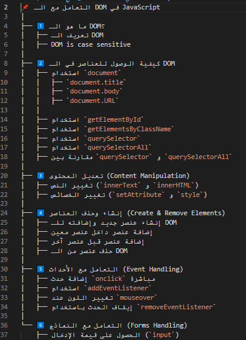

# **📌 التعامل مع الـ DOM في JavaScript**


## **1️⃣ ما هو الـ DOM؟**
الـ **Document Object Model (DOM)** هو **الواجهة البرمجية** التي تسمح لك بالتفاعل مع عناصر **صفحة الويب** وتعديلها باستخدام JavaScript.

---
## مهم:DOM is case sensetive

## **2️⃣ كيفية الوصول للعناصر في الـ DOM**
### 🔹 **باستخدام `document`**

📌 الدوكيومنت بيجي منين أصلاً؟
لما المتصفح يحمّل صفحة HTML، بيحوّلها إلى كائن شجري (Tree Structure)، وكل عنصر في الصفحة بيبقى كائن (Object) ضمن كائن رئيسي اسمه document، اللي هو نموذج كائن المستند (DOM - Document Object Model).
بمعنى إن document هو الطريقة اللي JavaScript بتتواصل بيها مع صفحة الويب علشان تقرأ وتعدل عليها.


📌 إزاي أقدر أشوف document بالكامل؟
لو فتحت الكونسول في المتصفح (F12 > Console) وكتبت:

```javascript
console.log(document);
```

```javascript
console.log(document.title); // طباعة عنوان الصفحة
console.log(document.body);  // طباعة محتوى الـ body
console.log(document.URL);   // طباعة رابط الصفحة الحالي
```

### 🔹 **باستخدام `getElementById`**
هنا بقوله هاتلي التاج كله

```javascript
let element = document.getElementById("myElement");
console.log(element.textContent); // عرض النص الموجود داخل العنصر وهى بتستخدم مع التاجات عادا الانبت تاج او input
// for input tag we use .value
```

### 🔹 **باستخدام `getElementsByClassName`**
.ناتج العمليه ديه انه بيجيبلي كوليكشن مش عنصر واحد
ليه؟ عشان ممكن كذا تاج يكون له نفس الكلاس
<br>
كانها بالظبط بترجع اراي, بس هى في الدوم اسمها الصحيح كولكشن, والاندكس بتاعها بيدا من 0

```javascript
let elements = document.getElementsByClassName("myClass");
// لو انا عايز اجيب تاج معين هشوف الاندكس بتاعه واختاره
let firstElement = inputElement[0]; 
console.log(firstElement);
// عايز نص تاج معين
console.log(elements[0].textContent); 
```

### 🔹 **باستخدام `querySelector` و `querySelectorAll`**

```javascript
let firstElement = document.querySelector(".myClass"); // أول عنصر فقط
console.log(firstElement.textContent);

let allElements = document.querySelectorAll(".myClass"); // كل العناصر
allElements.forEach(element => console.log(element.textContent));
```

### 🔹 **الفرق بين `querySelector` و `querySelectorAll`**
| الخاصية | `querySelector` | `querySelectorAll` |
|----------|----------------|------------------|
| الإرجاع | يُرجع أول عنصر مطابق فقط | يُرجع كل العناصر المطابقة |
| نوع البيانات | كائن عنصر (`Element`) | ليست(`NodeList`) يمكن اعمل لوب عليها |
| دعم تحديد CSS المتقدم | ✅ نعم | ✅ نعم |
| إمكانية استهداف عدة عناصر | ❌ لا | ✅ نعم |

🔹 **مثال توضيحي**:
```javascript
let firstParagraph = document.querySelector(".container p"); // يُرجع أول <p> داخل .container فقط
let allParagraphs = document.querySelectorAll(".container p"); // يُرجع جميع <p> داخل .container
```
المثال الي جاي عشان اوضحلك فكرة السليكتور بس ب querySelectorAll 
```html
<div class="container">
    <p class="text">Paragraph 1</p>
    <p class="text">Paragraph 2</p>
</div>

<p class="text">Paragraph 3</p>  <!-- خد بالك في براجراف هنا اهو برا الديف -->
```
 🔹 **لو استخدمت `getElementsByClassName("text")`:**
   - هترجع **كل الفقرات `<p>`** اللي عندها `class="text"` بدون تحديد موقعها في الصفحة.

🔹 **لكن لو استخدمت `querySelectorAll(".container .text")`:**
   - هترجع **بس الفقرات `<p>` اللي جوه `div.container`**.
   - وده مش ممكن تعمله بـ `getElementsByClassName()` لأنه بيجيب العناصر بغض النظر عن موقعها داخل عناصر أخرى.

---
## **3️⃣ تعديل المحتوى (Content Manipulation)**
### 🔹 **تغيير النص الداخلي (`innerText` و `innerHTML`)**
```javascript
document.getElementById("myElement").innerText = "Hello, World!";
document.getElementById("myElement").innerHTML = "<strong>Bold Text</strong>";
```

### 🔹 **تغيير الخصائص (`setAttribute` و `style`)**
setAttribute =  اسم الخاصية اللي عايز تضيفها أو تغيرها، زي class, id, src, href, alt... إلخ.
```javascript
document.getElementById("myElement").setAttribute("class", "newClass"); // في مثال في ال example folder
document.getElementById("myElement").style.color = "red";
document.getElementById("myElement").style.fontSize = "20px";
```

---
## **4️⃣ إنشاء وحذف العناصر (Create & Remove Elements)**
### 🔹 **إنشاء عنصر جديد وإضافته للـ DOM**
```javascript
let newElement = document.createElement("p");
newElement.innerText = "This is a new paragraph!";
document.body.appendChild(newElement);
```

### 🔹 **إضافة عنصر داخل عنصر معين**
```javascript
let parent = document.getElementById("container");
let child = document.createElement("span");
child.innerText = "I am inside the container!";
parent.appendChild(child);
```

### 🔹 **إضافة عنصر قبل عنصر آخر**
```javascript
let reference = document.getElementById("referenceElement");
let newDiv = document.createElement("div");
newDiv.innerText = "Inserted Before!";
document.body.insertBefore(newDiv, reference);
```

### 🔹 **حذف عنصر من الـ DOM**
```javascript
let element = document.getElementById("myElement");
element.remove();
```

---
## **5️⃣ التعامل مع الأحداث (Event Handling)**
عندي طريقتين: اما اون كليك او ايفينت ليستنر

### 🔹 **إضافة حدث `onclick` مباشرة**
```javascript
document.getElementById("myButton").onclick = function() {
    alert("Button Clicked!");
};
```

### 🔹 **استخدام `addEventListener`**
```javascript
let button = document.getElementById("myButton");
button.addEventListener("click", function() {
    console.log("Button Clicked!");
    button.style.backgroundColor = "blue";
});
```

### 🔹 **إضافة حدث `mouseover` لتغيير لون عنصر**
```javascript
let box = document.getElementById("box");
box.addEventListener("mouseover", function() {
    box.style.backgroundColor = "yellow";
});
box.addEventListener("mouseout", function() {
    box.style.backgroundColor = "white";
});
```

### 🔹 **إيقاف الحدث باستخدام `removeEventListener`**
```javascript
function sayHello() {
    console.log("Hello!");
}
let btn = document.getElementById("stopButton");
btn.addEventListener("click", sayHello);
setTimeout(() => {
    btn.removeEventListener("click", sayHello);
}, 5000); // يوقف الحدث بعد 5 ثوانٍ
```

---
## **6️⃣ التعامل مع النماذج (Forms Handling)**
### 🔹 **الحصول على قيمة الإدخال (`input`)** 
```javascript
let inputField = document.getElementById("nameInput");
console.log(inputField.value);
```

```